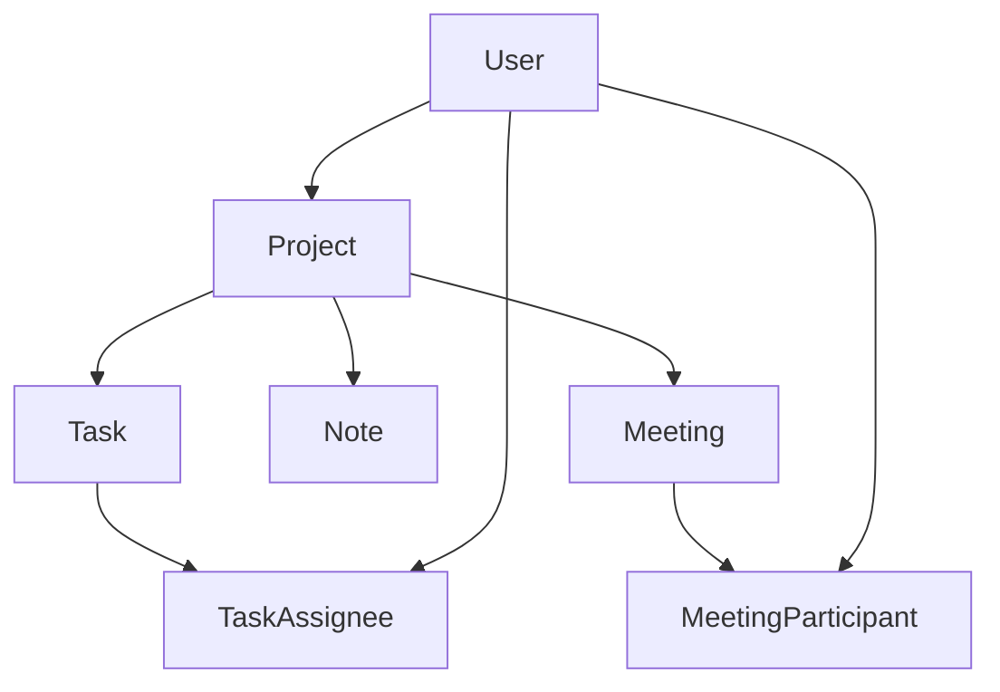

# ORCAFLOW v0.1.0

A minimal, modern web app to help small teams (4–5 members) manage projects, track tasks, document meetings, and collaborate — without the bloat of Jira/Notion.


## 🎯 Why ORCAFLOW?

Small development, design, and product teams often struggle with fragmented communication across multiple tools. WhatsApp and Discord threads create distraction and make it difficult to maintain structured workflows for task management, meeting documentation, and collaboration.

ORCAFLOW provides a minimal, focused workspace that replaces chaotic messaging threads with structured project management, offering just enough functionality without the complexity and overhead of comprehensive tools like Jira or Notion.

## ✨ Key Features (v0.1.0)

### 🔐 Authentication
- **Google Sign-in** + Email/Password via Supabase Auth
- Basic user roles (Admin/Member)
- Secure session management

### 📁 Projects
- **Container-based organization** for related work
- Project creation with title, description, and ownership
- Centralized hub for tasks, notes, and meetings

### ✅ Tasks Management
- **Kanban board** with three states (Todo → Doing → Done)
- Drag-and-drop functionality with optimistic UI updates
- Task creation with title, description, assignee, due dates, and tags
- Real-time visual feedback and database persistence

### 🤝 Team Collaboration
- **Project invitations** system for team members
- Member management with role-based access
- Row Level Security (RLS) for data protection

### 🎨 Modern UI/UX
- **Dark and Light mode** support
- Deep purple color palette (#2A0049 primary, #0A0012 background)
- Responsive design for all screen sizes
- Smooth animations and transitions

## 🛠 Tech Stack

### Frontend
- **Next.js (App Router)** - React framework with SSR and API routes
- **Tailwind CSS** - Utility-first CSS framework
- **shadcn/ui** - Modern component library with Radix UI primitives
- **@dnd-kit** - Drag-and-drop functionality for Kanban boards

### Backend & Database
- **Supabase** - Backend-as-a-Service platform
  - PostgreSQL database with Prisma ORM
  - Authentication (Google OAuth + Email/Password)
  - File storage for assets
  - Real-time subscriptions
- **Prisma** - Type-safe database access and migrations

### Development Tools
- **pnpm** - Package manager
- **Jest** - Testing framework
- **ESLint** - Code linting

## 🚀 Quick Start

### Prerequisites
- Node.js 18+
- pnpm package manager
- Supabase account (free plan)

### 1. Clone and Setup

```bash
git clone <your-repo-url>
cd orcaflow
pnpm install
```

### 2. Environment Variables

Create a `.env.local` file in the root directory:

```env
# Supabase Configuration
NEXT_PUBLIC_SUPABASE_URL=your_supabase_url
NEXT_PUBLIC_SUPABASE_ANON_KEY=your_supabase_anon_key
SUPABASE_SERVICE_ROLE_KEY=your_service_role_key

# OAuth (Google)
GOOGLE_CLIENT_ID=your_google_client_id
GOOGLE_CLIENT_SECRET=your_google_client_secret

# NextAuth Secret
NEXTAUTH_SECRET=your_nextauth_secret
NEXTAUTH_URL=http://localhost:3000
```

### 3. Database Setup

```bash
# Generate Prisma client
pnpm prisma generate

# Run database migrations
pnpm prisma migrate dev

# Seed database (optional)
pnpm prisma db seed
```

### 4. Run Development Server

```bash
pnpm dev
```

Open [http://localhost:3000](http://localhost:3000) to see the application.

## 📖 Usage Guide

### Getting Started
1. **Sign up** or log in with Google/Email
2. **Create your first project** using the "New Project" button
3. **Invite team members** via email invitations
4. **Start adding tasks** to your Kanban board

### Core Workflows

#### Creating Tasks
1. Navigate to your project
2. Click the **"+" button** in the Tasks section
3. Fill in task details:
   - Title (required)
   - Description (optional)
   - Assignee (select from project members)
   - Due date (optional)
   - Tags (optional)

#### Managing Tasks
- **Drag and drop** tasks between columns (Todo → Doing → Done)
- **Edit tasks** by clicking on task cards
- **Filter tasks** by assignee, due date, or tags
- **View task details** including creation date and activity

#### Team Collaboration
- **Invite members** to projects via email
- **Manage permissions** (basic admin/member roles)
- **Share project context** with all team members

#### Documentation
- **Create notes** using the markdown editor
- **Link notes to projects** for organization
- **Search content** across all notes

## 🏗 Architecture Overview

### System Architecture
```
┌─────────────────┐    ┌─────────────────┐
│   Next.js App   │◄──►│    Supabase     │
│   (Frontend)    │    │   (Backend)     │
│                 │    │                 │
│ • React/Next.js │    │ • PostgreSQL    │
│ • Tailwind CSS  │    │ • Auth          │
│ • shadcn/ui     │    │ • File Storage  │
│ • Drag & Drop   │    │ • Real-time     │
└─────────────────┘    └─────────────────┘
```

### Key Components
- **Projects** - Container entities for organizing work
- **Tasks** - Individual work items with Kanban workflow
- **Notes** - Markdown documentation per project
- **Users** - Team members with role-based access
- **Invitations** - System for adding members to projects

### Database Schema


## 🔌 API Documentation

### Core Endpoints

#### Projects
```http
GET    /api/projects              # List user's projects
POST   /api/projects              # Create new project
GET    /api/projects/[id]         # Get project details
```

#### Tasks
```http
GET    /api/projects/[id]/tasks   # List project tasks
POST   /api/projects/[id]/tasks   # Create new task
PUT    /api/tasks/[id]            # Update task
DELETE /api/tasks/[id]            # Delete task
```

#### Team Management
```http
GET    /api/projects/[id]/members # List project members
POST   /api/projects/[id]/invites # Invite new member
DELETE /api/projects/[id]/members/[userId] # Remove member
```

### Authentication
All API endpoints require authentication via Supabase JWT tokens in the `Authorization` header:

```http
Authorization: Bearer <supabase_jwt_token>
```

## 🚢 Deployment

### Production Deployment

#### Frontend (Vercel)
1. Connect your GitHub repository to Vercel
2. Add environment variables in Vercel dashboard
3. Deploy automatically on push to main branch

#### Backend (Supabase)
1. Create production Supabase project
2. Update environment variables with production URLs
3. Run migrations in production database

### Environment Variables (Production)
```env
# Production Supabase
NEXT_PUBLIC_SUPABASE_URL=https://your-project.supabase.co
NEXT_PUBLIC_SUPABASE_ANON_KEY=your_production_anon_key
SUPABASE_SERVICE_ROLE_KEY=your_production_service_key

# OAuth (Google) - Production
GOOGLE_CLIENT_ID=your_production_google_client_id
GOOGLE_CLIENT_SECRET=your_production_google_client_secret

# NextAuth
NEXTAUTH_SECRET=your_production_nextauth_secret
NEXTAUTH_URL=https://yourdomain.com
```

## 🤝 Contributing

### Development Setup
1. Fork the repository
2. Create a feature branch: `git checkout -b feature/amazing-feature`
3. Make your changes
4. Run tests: `pnpm test`
5. Commit changes: `git commit -m 'Add amazing feature'`
6. Push to branch: `git push origin feature/amazing-feature`
7. Open a Pull Request

### Code Style
- Use ESLint configuration for code formatting
- Follow React/Next.js best practices
- Write tests for new features
- Update documentation for API changes

### Testing
```bash
# Run all tests
pnpm test

# Run tests in watch mode
pnpm test:watch

# Run specific test file
pnpm test TaskForm.test.jsx
```

## 📝 Changelog

### v0.1.0 (October 2025)
- ✅ **Complete MVP** with all core features implemented
- ✅ **Authentication** - Google OAuth + Email/Password
- ✅ **Projects** - Container-based organization
- ✅ **Tasks** - Full Kanban board with drag-and-drop
- ✅ **Team Collaboration** - Invitations and member management
- ✅ **Notes** - Markdown editor for documentation
- ✅ **Modern UI** - Dark/Light mode, responsive design
- ✅ **Security** - Row Level Security policies implemented

## 🎯 Roadmap

### v1.5 (Next Release)
- In-app notifications for task assignments
- Email notifications via Supabase Edge Functions
- Command palette for global search
- Keyboard shortcuts for power users

### v2.0 (Future)
- Real-time collaborative Excalidraw boards
- AI-assisted meeting summaries
- Advanced permissions system
- Mobile app (React Native)

## 📄 License

This project is licensed under the MIT License - see the [LICENSE](LICENSE) file for details.

## 🙏 Acknowledgments

- **shadcn/ui** - Beautiful, accessible component library
- **Supabase** - Amazing backend-as-a-service platform
- **Vercel** - Excellent deployment platform for Next.js
- **@dnd-kit** - Powerful drag-and-drop library

## 📞 Support

For support, email [your-email@example.com] or create an issue in the GitHub repository.

---

**Made with ❤️ for small teams who value simplicity and focus.**